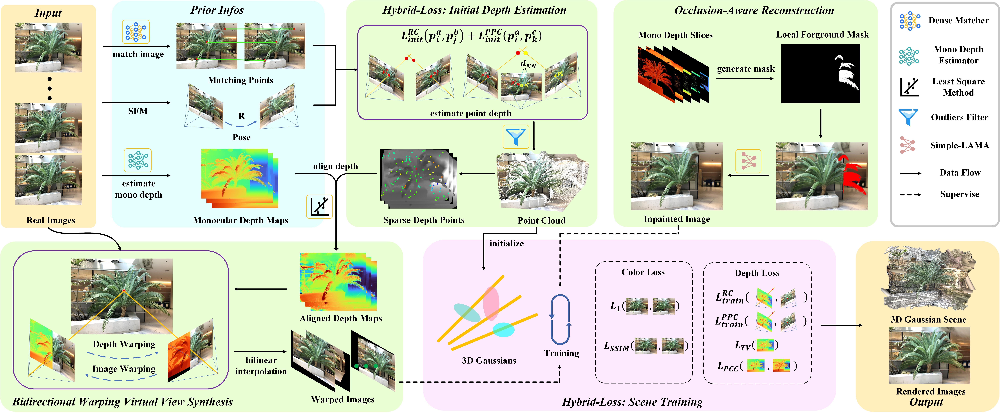

# HBSplat

[](https://arxiv.org/abs/2509.24893)

**Official PyTorch implementation of the paper _"Enhancing Sparse-View 3D Reconstruction with HBSplat"_.**

> **[Yu Ma]**, **[Guoliang Wei]**, **[Haihong Xiao]**, **[Yue Cheng]** <br>

---

## 📌 Overview

HBSplat is a novel unified framework designed to tackle the challenge of **high-quality Novel View Synthesis (NVS) from sparse input views**. Built upon 3D Gaussian Splatting (3DGS), it overcomes the limitations of vanilla 3DGS in sparse settings—such as floating artifacts and geometric distortions—through three core technical contributions:

- **🔥 Hybrid-Loss Depth Estimation (HLDE)**: Enforces robust multi-view geometric consistency.
- **🔥 Bidirectional Warping Virtual View Synthesis (VVS)**: Generates virtual training views to impose stronger constraints.
- **🔥 Occlusion-Aware Reconstruction (OAR)**: Recovers missing content in heavily occluded regions.

<p align="center">
  
</p>


---

## ✨ News

* **[2025-10-09]**: 🎉 Code are released!
* **[2025-10-09]**: 📜 Initial preprint is available on [arXiv](https://arxiv.org/abs/2509.24893).

---

## 🛠️ Installation


1. **Clone this repository:**
   
   ```bash
   git clone https://github.com/eternalland/HBSplat.git
   cd HBSplat
2. **Set up the environment:**

   We recommend using **Python 3.8+** and **PyTorch 2.0.0+** with CUDA 11.8+.

   ```tex
   # Create a conda environment (optional but recommended)
   conda create -n hbsplat python=3.8
   conda activate hbsplat
   
   # Install PyTorch (Please check the official PyTorch website [https://pytorch.org/get-started/previous-versions/] for the correct command for your system)
   pip install torch==2.0.0 torchvision==0.15.1 torchaudio==2.0.1 --index-url https://download.pytorch.org/whl/cu118
   
   # Install 
   pip install submodules/diff-gaussian-rasterization submodules/simple-knn
   
   # Install dependencies
   pip install -r requirements.txt
   
   # Install external components
   # Our project relies on two external components for dense matching and depth estimation.
   git clone https://github.com/xuelunshen/gim.git
   git clone https://github.com/apple/ml-depth-pro.git
   ```

## **📚 Dataset Preparation**

download: [LLFF](https://www.matthewtancik.com/nerf), [ibrnet](https://github.com/googleinterns/IBRNet?tab=readme-ov-file) , [blender](https://www.matthewtancik.com/nerf) , [dtu](https://roboimagedata.compute.dtu.dk/?page_id=36),  [Tanks&Temple](https://www.tanksandtemples.org/)

Matching datas and mono depth map datas of LLFF, Blender, and ibrnet datasets are provided from [here](https://drive.google.com/drive/folders/1lBg8iQs4DVFVRLhX29yxtngE-n6q0YMV).

Please download the following datasets and organize them as below:

```bash
data/
├── nerf_llff_data/
│   └── fern flower fortress horns leaves orchids room trex # LLFF dataset
├── ibrnet/
│   └── zc12 zc14 zc15 zc16 zc17 zc18 # ibrnet dataset
├── nerf_synthetic/
│   └── chair drums ficus hotdog lego materials mic ship # Blender dataset
├── dtu/
│   └── scan8 21 30 31 34 38 40 41 45 55 63 82 103 110 114 # DTU dataset
└── colmap_Tanks_Temple/
    └── Family Francis Horse Lighthouse M60 Panther Playground Train # Tanks&Temples dataset
```

## **🏃 Quick Start**

### 1. Training on one Scene

To train HBSplat on the LLFF scene with 3 input views:

```tex
# generate matching datas and monocular depth datas
python train.py -s ./data/nerf_llff_data/fern -m ./output/fern -r 8 --eval --input_views 3 -- switch_generate_matching_mono 1 --inv_scale 4
# training
python train.py -s ./data/nerf_llff_data/fern -m ./output/fern -r 8 --eval --input_views 3
# rendering
python render.py -s ./data/nerf_llff_data/fern -m ./output/fern
# metrics
python metrics.py -m ./output/fern
```

To train HBSplat on the Blender Chair scene with 8 input views:

```tex
# generate matching datas and monocular depth datas
python train.py -s ./data/nerf_synthetic/chair -m ./output/chair -r 2 --eval --input_views 8 -- switch_generate_matching_mono 1 --inv_scale 2
# training
python train.py -s ./data/nerf_synthetic/chair -m ./output/chair -r 2 --eval --input_views 8 --white_background
# rendering
python render.py -s ./data/nerf_synthetic/chair -m ./output/chair --white_background
# metrics
python metrics.py -m ./output/chair
```


### 2. Training on multi Scene

To train HBSplat on the LLFF

```bash
# LLFF
/bin/bash ./exe_llff.sh
# ibrnet
/bin/bash ./exe_ibrnet.sh
# Blender
/bin/bash ./exe_blender.sh
# dtu
/bin/bash ./exe_dtu.sh
# tanks&temples
/bin/bash ./exe_tt.sh
```

## **🙏 Citation**

If you find our work useful in your research, please consider citing:

bibtex

```latex
@article{my2025hbsplat,
  title={HBSplat: Robust Sparse-View Gaussian Reconstruction with Hybrid-Loss Guided Depth and Bidirectional Warping},
  author={Yu ma, Guoliang Wei, Honghai xiao and Yue cheng},
  journal={arXiv preprint arXiv:2509.24893},
  year={2025}
}
```

## **🤝 Acknowledgement**

We thank the following great works that inspired our research:

- [3D Gaussian Splatting (3DGS)](https://repo-sam.inria.fr/fungraph/3d-gaussian-splatting/)
- [SCGaussian](https://github.com/prstrive/SCGaussian)
- [gim](https://github.com/xuelunshen/gim)
- [depth-pro](https://github.com/apple/ml-depth-pro)
- And other great works in the field.
